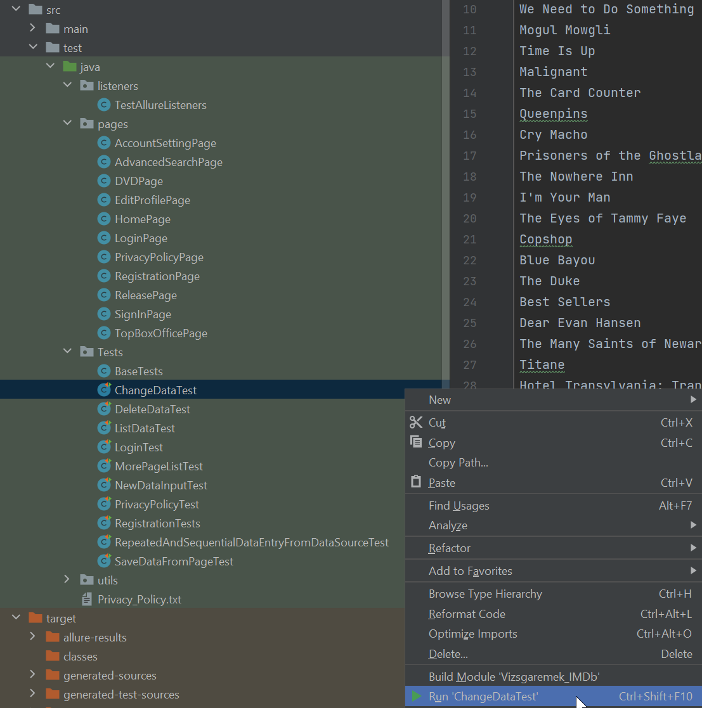
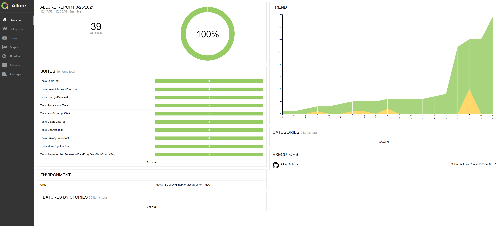

# 
Vizsgaremek

***
>## 
IMDb weboldal tesztelése

>>### Linkek:
>>>* [Github](https://github.com/TBCodec/Vizsgaremek_IMDb)
>>>* [Tesztmenedzser](https://docs.google.com/spreadsheets/d/1DvklzVpEp8adIK4msi6FuN1quvwjfxygE1bSO5PpNVI/edit?usp=sharing)
>>>* [Követelmény nyomonkövetés](https://docs.google.com/spreadsheets/d/12Tn-UG9_3HJb-EvQFme00NhMU1L2mAGkQtgXRJeNHUQ/edit?usp=sharing)
>>>* [Allure riport](https://tbcodec.github.io/Vizsgaremek_IMDb/)
>>### Tesztek futtatása:
>>>* Töltsük le a Github repot a gépünkre
>>>* Valamilyen integrált fejlesztői környezettel (pl.: IntelliJ IDEA) futtathatjuk a teszteket 
>>>* Az src/test/java/Tests mappában találhatók a futtatható java teszt fájlok
>>>* IntelliJ IDEA környezetben nyomjuk meg a jobb egérgombot a teszt fájlon és válasszuk a run parancsot:
> 

